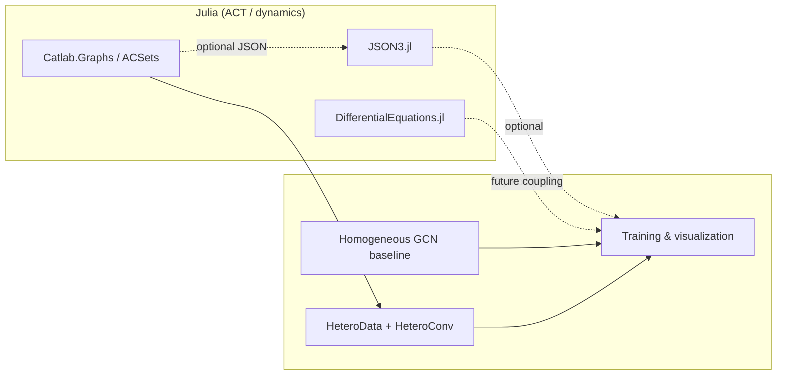

# Physics-Informed Surrogate Modeling via Applied Category Theory (ACT–GNN) — Phase 2

[](https://julialang.org/)
[](https://www.python.org/)
[](https://pytorch-geometric.readthedocs.io/)

[🇺🇸 English](#english) | [🇯🇵 日本語](#japanese)

<a id="english"></a>

## English

### Overview

**ACT–GNN Phase 2** extends the Phase‑1 line of work: it stress-tests **physics-informed graph surrogates** where (i) **graph cardinality** changes across deployment (scale), and (ii) **multiple constitutive laws** share the same discrete substrate (multiphysics). The central design choice is to treat heterogeneous interactions as **schema-level structure**—materialized in PyTorch Geometric as `HeteroData` with `HeteroConv`—rather than as a single mixed edge set with opaque attributes.

| Layer | Role in this repository |
| --- | --- |
| **Julia / ACT** | `Catlab.jl` and `Catlab.Graphs` for a minimal, auditable **categorical tooling spine** (`test_catlab.jl`). `Project.toml` pins **DifferentialEquations.jl** and **JSON3.jl** for dynamics-heavy extensions and structured interchange toward Python. |
| **Python / PyG** | Executable tracks: **scale** (`demo1_scale_generalization.py`), **multiphysics** (`demo2_category_multiphysics.py`), **Phase 1 §3–matched** GNN vs MLP benchmark (`compare_loss_visualization.py` + bundled `import_catlab_json_to_pyg.py`), optional Zenn figure helper (`article_figures_for_zenn.py`), and **device smoke test** (`test_gpu.py`). |

**Implemented physics.** Each node carries a 2D state \([u, v]\) (scalar position and velocity along a 1D chain). **Springs** apply Hooke forces \(\propto (u_j - u_i)\); **dampers** apply forces \(\propto (v_j - v_i)\) where applicable. Supervision is a **single explicit Euler-type step** \(v' = v + (F/m)\,\Delta t\), \(u' = u + v\,\Delta t\) with forces assembled from the active topology (see source for exact update order per script).

**Indexing contract (Julia ↔ PyG).** Julia’s graph APIs conventionally use **1-based** vertex labels; PyTorch Geometric expects **0-based** node indices in `edge_index`. For any **Catlab → JSON → Python** path, perform the **1-based → 0-based conversion exactly once** at the export/ingest boundary so downstream training sees one canonical integer labeling—this avoids silent off-by-one bugs when mixing languages.

| Track | Script | What it fixes / proves |
| --- | --- | --- |
| **Scale** | `demo1_scale_generalization.py` | A flattened **NaiveMLP** is tied to a fixed \(N\); at inference with \(N=50\) after being sized for \(N=10\) it raises **`RuntimeError`** (shape mismatch). A small **GCN** stack accepts variable `edge_index` and completes forward on the larger chain (**no training** in this demo; `torch.manual_seed(0)`). |
| **Multiphysics** | `demo2_category_multiphysics.py` | Alternating **spring** and **damper** bonds on an even-length chain; **HomogeneousGNN** mixes both relation types in one `edge_index`; **CategoryHeteroGNN** routes springs and dampers through **separate** `GCNConv` towers inside `HeteroConv`. Writes **`zenn-articles/images/hetero_loss_comparison.png`** when that folder exists (else repo root, gitignored). |
| **JSON + Phase 1 §3 match** | `compare_loss_visualization.py` | **Same** supervision as [Phase 1 `train_spring_mass_gcn.py`](https://github.com/kohmaruworks/physics-gnn-surrogate-basic): **`spring_mass_chain_5.json`** (place sibling repo `physics-gnn-surrogate-basic` next to this one), **TwoLayerGCN** (hidden 16) vs **NaiveMLP**, `Adam` **lr=0.02**, **100** epochs, **training** MSE. Writes **`zenn-articles/images/loss_comparison_test.png`** if that folder exists (else this repo root, gitignored). |

**Default hyperparameters (as in source).**

| Setting | `demo1_scale_generalization.py` | `demo2_category_multiphysics.py` | `compare_loss_visualization.py` (when runnable) |
| --- | --- | --- | --- |
| Design \(N\) / nodes | Train layout \(N_{\mathrm{design}}=10\); inference \(N=50\) | `num_nodes = 12` (even; chain topology) | `Data.num_nodes` from **`spring_mass_chain_5.json`** (sibling `physics-gnn-surrogate-basic`) |
| Features / hidden | `feat_dim = 2`, GNN `hidden = 32` | `feat_dim = 2`, `hidden = 64` | `feat_dim = 2`, GNN (TwoLayer) & MLP **`hidden = 16`** |
| Optimizer / epochs | *(none — forward only)* | `Adam`, `lr = 1e-3`, `epochs = 200` | `Adam`, `lr = 0.02`, `epochs = 100`; **training** MSE (Phase 1 §3 match) |
| Physics constants | — | `k = 1.0`, `c = 0.8`, `m = 1.0`, `dt = 0.05` | — (teacher **`y`** is Julia ODE in JSON) |
| Data randomness | `torch.randn` for \(x_{50}\) | Initial state pool: `pool_size = 64`; `torch.manual_seed(7)`, generator seed `12345`; `pos_scale = 1.0`, `vel_scale = 0.6` | **One** graph, one \((x,y)\) pair — not a multi-split benchmark |
| PyG topology | Directed chain edges \((i,i{+}1)\) | Springs: pairs \((0,1),(2,3),\ldots\); dampers: \((1,2),(3,4),\ldots\); each logical bond expanded **bidirectionally** for `edge_index` | Chain edges from JSON `edge_index` |

**Implementation note (`compare_loss_visualization.py`).** With ODE-supervised single-graph training, a **TwoLayerGCN** and a **NaiveMLP** (same `lr`, `epochs`) can reach different **training** MSE plateaus; this matches the function-class discussion in the [Phase 1 §6](https://zenn.dev/kohmaruworks/articles/phase1-06-training-outlook) article. Figures are versioned in **`zenn-articles/images/loss_comparison_test.png`**, not in this repository.

### Architecture

| Stage | Location | Responsibility |
| --- | --- | --- |
| 1. Categorical incidence | Julia (`test_catlab.jl`, future ACSets) | Declare vertices as **objects** and edges as **typed generating morphisms** before any training. |
| 2. Schema → tensors | Python (`demo2_*`, optional JSON loader) | Materialize relation types as **disjoint** `edge_index` blocks (`HeteroData`) or a deliberately mixed baseline (`Data`). |
| 3. Learning & plots | Python (PyG + `matplotlib`) | Fit surrogates against physics-generated one-step targets; export loss curves / PNGs. |

Process detail:

1. **Julia** instantiates the dependency stack (`Catlab`, optional `DifferentialEquations`, `JSON3`) and can emit **structured** graph data; **JSON artifacts are gitignored** (see `.gitignore`) so exports stay reproducible but out of version control unless you vendor them.
2. **Python** either **constructs** the hetero schema directly (`demo2_category_multiphysics.py`) or **ingests** JSON via `import_catlab_json_to_pyg.py` (`compare_loss_visualization.py` loads **`spring_mass_chain_5.json`** from sibling **`physics-gnn-surrogate-basic`**) with the **0-based** indexing contract above.
3. **Baselines** are always co-located: homogeneous vs hetero in multiphysics; GNN vs MLP in optional JSON track; MLP failure mode in scale demo.



### File Structure

| Path | Role |
| --- | --- |
| `Project.toml` / `Manifest.toml` | Julia environment: **Catlab**, **DifferentialEquations**, **JSON3**. |
| `test_catlab.jl` | Loads `Catlab` / `Catlab.Graphs`, builds a tiny graph, prints incidence counts. |
| `demo1_scale_generalization.py` | Scale track: `CategoryInformedGNN` vs `NaiveMLP`, variable \(N\), no optimization loop. |
| `demo2_category_multiphysics.py` | Multiphysics track: `HomogeneousGNN` vs `CategoryHeteroGNN`, training loop; figure → **`zenn-articles/images/hetero_loss_comparison.png`**. |
| `import_catlab_json_to_pyg.py` | `catlab_directed_graph_v1` JSON → `torch_geometric.data.Data` (same contract as Phase 1). |
| `compare_loss_visualization.py` | Phase 1 §3-matched GNN vs MLP training curve; requires **`../physics-gnn-surrogate-basic/spring_mass_chain_5.json`**; figure → **`zenn-articles/images/loss_comparison_test.png`**. |
| `article_figures_for_zenn.py` | Optional: writes Zenn images (e.g. teacher scatter) using `graph_from_catlab.json` when present. |
| `test_gpu.py` | CUDA availability and large `matmul` timing. |
| `.gitignore` | Virtualenvs, caches, **`*.json`**, and generated **PNG**s (`loss_comparison_test.png`, `hetero_loss_comparison.png`). |

### Quick Start

**Julia**

```bash
cd /path/to/physics-gnn-surrogate-act
julia --project=. -e 'using Pkg; Pkg.instantiate()'
julia --project=. test_catlab.jl
```

**Python**

```bash
python -m venv .venv
source .venv/bin/activate   # Windows: .venv\Scripts\activate
pip install torch torch-geometric matplotlib

python demo1_scale_generalization.py
python demo2_category_multiphysics.py
python test_gpu.py
```

**Phase 1 §3 benchmark (`compare_loss_visualization.py`):** clone or place sibling repo **[physics-gnn-surrogate-basic](https://github.com/kohmaruworks/physics-gnn-surrogate-basic)** next to this one so **`../physics-gnn-surrogate-basic/spring_mass_chain_5.json`** exists (generate via Julia export if needed). Training curves are written to **`zenn-articles/images/loss_comparison_test.png`** when **`../zenn-articles/images`** exists.

```bash
python compare_loss_visualization.py
```

**Optional (Zenn article figures):** with `graph_from_catlab.json` in this repo and **`../zenn-articles/images`**, run `python article_figures_for_zenn.py` (used by the Phase 1 / Phase 2 article pipeline).

<a id="japanese"></a>

## 日本語

### 概要

**ACT–GNN Phase 2** は Phase 1 の流れを継承し、(i) デプロイ時に変動する**グラフサイズ（スケール）**と、(ii) 同一離散基盤上に共存する**複数の構成則（マルチフィジックス）**という二つの圧力下で、**物理情報付きグラフ・サロゲート**を検証します。設計上の主眼は、異種相互作用を単一の混在 `edge_index` の不透明な属性ではなく、**スキーマ上の構造**として扱い、PyTorch Geometric では `HeteroData` と `HeteroConv` に具体化することです。

| レイヤ | 本リポジトリでの役割 |
| --- | --- |
| **Julia / ACT** | `Catlab.jl` と `Catlab.Graphs` による、監査しやすい最小の**圏論ツールチェーン**（`test_catlab.jl`）。`Project.toml` では **DifferentialEquations.jl** と **JSON3.jl** を固定し、动力学寄りの拡張と Python 向けの構造化インタチェンジを想定しています。 |
| **Python / PyG** | 実行可能なトラックとして、**スケール**（`demo1_scale_generalization.py`）、**マルチフィジックス**（`demo2_category_multiphysics.py`）、**第3回同条件**の GNN/MLP 比較（`compare_loss_visualization.py` ＋同梱 `import_catlab_json_to_pyg.py`）、任意の **Zenn 図**（`article_figures_for_zenn.py`）、**デバイス確認**（`test_gpu.py`）。 |

**実装されている物理。** 各ノードは 2 次元状態 \([u, v]\)（1 次元座標上の位置・速度）。**バネ**はフックの法則に従い \(\propto (u_j - u_i)\)、**ダンパ**（該当スクリプト）は \(\propto (v_j - v_i)\) の力を寄与します。教師信号は、合力から \(a=F/m\) を得たうえでの**陽的オイラー型 1 ステップ** \(v' = v + a\,\Delta t\)、\(u' = u + v\,\Delta t\)（スクリプトごとの更新順はソース参照）。

**インデックス契約（Julia ↔ PyG）。** Julia 側のグラフ API は慣習として**1 始まり**の頂点ラベルを用いますが、PyTorch Geometric の `edge_index` は**0 始まり**です。**Catlab → JSON → Python** の経路では、エクスポートまたは取り込みの境界で **1 始まりから 0 始まりへの変換を一度だけ**行い、下流の学習では単一の整数ラベリングを前提にしてください（言語混在時の off-by-one を防ぐため）。

| トラック | スクリプト | 示していること |
| --- | --- | --- |
| **スケール** | `demo1_scale_generalization.py` | 平坦化 **NaiveMLP** は設計時のノード数に固定され、\(N=10\) 用に構築したのち **\(N=50\)** を流すと **`RuntimeError`**（形状不一致）。小さな **GCN** は `edge_index` だけ変えて大きいチェーンでも forward 可能（本デモは**学習なし**、`torch.manual_seed(0)`）。 |
| **マルチフィジックス** | `demo2_category_multiphysics.py` | 偶数長チェーン上で **バネ**・**ダンパ**を交互配置。**HomogeneousGNN** は両者を同一 `edge_index` に混在、**CategoryHeteroGNN** は `HeteroConv` 内の別 **GCNConv** 経路に分離。図は **`zenn-articles/images/hetero_loss_comparison.png`**（隣接 Zenn リポが無い場合は本リポ直下・`.gitignore` 対象）。 |
| **第3回条件ベンチ** | `compare_loss_visualization.py` | [基礎編](https://github.com/kohmaruworks/physics-gnn-surrogate-basic) の **`spring_mass_chain_5.json`** と**同一**教師 $y$（Julia ODE）で、**TwoLayerGCN** と**平坦化 MLP**の**訓練**MSE を比較。図は **`zenn-articles/images/loss_comparison_test.png`**。`import_catlab_json_to_pyg.py` を同梱。 |

**既定ハイパーパラメータ（ソース値）。**

| 設定 | `demo1_scale_generalization.py` | `demo2_category_multiphysics.py` | `compare_loss_visualization.py`（実行可能な場合） |
| --- | --- | --- | --- |
| 設計 \(N\) / ノード数 | 設計 \(N_{\mathrm{design}}=10\)、推論 \(N=50\) | `num_nodes = 12`（偶数・チェーン位相） | **`spring_mass_chain_5.json`** の `Data.num_nodes` |
| 特徴 / 隠れ次元 | `feat_dim = 2`、GNN `hidden = 32` | `feat_dim = 2`、`hidden = 64` | `feat_dim = 2`、GNN（2層）・MLP とも **`hidden = 16`** |
| 最適化 / エポック | *（forward のみ）* | `Adam`、`lr = 1e-3`、`epochs = 200` | `Adam`、`lr = 0.02`、`epochs = 100`、**訓練**MSE（第3回同条件） |
| 物理定数 | — | `k = 1.0`、`c = 0.8`、`m = 1.0`、`dt = 0.05` | —（教師 `y` は JSON 内の ODE 参照解） |
| データ乱数 | \(x_{50}\) 用 `torch.randn` | 固定プール `pool_size = 64`；`torch.manual_seed(7)`、ジェネレータ `12345`；`pos_scale = 1.0`、`vel_scale = 0.6` | **1 グラフ**の \((x,y)\) のみ（**200/150/50 分割ではない**） |
| PyG トポロジ | 有向チェーン辺 \((i,i{+}1)\) | バネ \((0,1),(2,3),\ldots\)、ダンパ \((1,2),(3,4),\ldots\)；各結合を **双方向** に展開して `edge_index` 化 | JSON の `edge_index`（有向チェーン） |

**実装上の注記（`compare_loss_visualization.py`）。** 第3回の**単一**教師付き学習と同条件で、**帰納的バイアス**（重み共有 GCN と平坦 MLP）の違いを**訓練**曲線に重ねる。図面は [Zenn 記事](https://zenn.dev/kohmaruworks/articles/phase1-06-training-outlook) 用の **`zenn-articles/images/loss_comparison_test.png`** です。

### アーキテクチャ

| 段階 | 所在 | 役割 |
| --- | --- | --- |
| 1. 圏論的インシデンス | Julia（`test_catlab.jl`、将来の ACSets） | 学習前に、頂点を**対象**、辺を**型付き生成 morphism** として宣言する。 |
| 2. スキーマ → テンソル | Python（`demo2_*`、任意の JSON ローダ） | 関係型を **互いに素な** `edge_index`（`HeteroData`）として具現化するか、意図的に混在させたベースライン（`Data`）とする。 |
| 3. 学習・プロット | Python（PyG + `matplotlib`） | 物理が生成した 1 ステップ先を教師にサロゲートを学習し、損失曲線や PNG を出力する。 |

プロセスの補足:

1. **Julia** で依存スタック（`Catlab`、任意で `DifferentialEquations`、`JSON3`）を確立し、**構造化**グラフデータを出力可能にする。**JSON は `.gitignore` によりリポジトリ外**が既定で、再現性はパイプライン側で担保します。
2. **Python** はスキーマを**直接構築**（`demo2_category_multiphysics.py`）するか、JSON を **`import_catlab_json_to_pyg` で取り込む**（`compare_loss_visualization.py` は**隣接** `physics-gnn-surrogate-basic` の **`spring_mass_chain_5.json`**）かに分かれ、いずれも上記の **0 始まり**契約に従います。
3. **ベースライン**は常に同所に置きます（マルチフィジックスでは同質対 Hetero、JSON トラックでは GNN 対 MLP、スケールデモでは MLP の失敗モード）。


### ファイル構成

| パス | 役割 |
| --- | --- |
| `Project.toml` / `Manifest.toml` | Julia 環境: **Catlab**、**DifferentialEquations**、**JSON3**。 |
| `test_catlab.jl` | `Catlab` / `Catlab.Graphs` をロードし、最小グラフを構築してインシデンス数を表示。 |
| `demo1_scale_generalization.py` | スケール軸: `CategoryInformedGNN` と `NaiveMLP`、可変 \(N\)、最適化ループなし。 |
| `demo2_category_multiphysics.py` | マルチフィジックス軸: `HomogeneousGNN` と `CategoryHeteroGNN`、学習ループ、図 → `zenn-articles/images/hetero_loss_comparison.png`。 |
| `import_catlab_json_to_pyg.py` | `catlab_directed_graph_v1` 形式の JSON → `Data` 復元（Phase 1 と同一契約）。 |
| `compare_loss_visualization.py` | 第3回同条件: TwoLayerGCN vs MLP。要 **`../physics-gnn-surrogate-basic/spring_mass_chain_5.json`**。図 → `zenn-articles/images/loss_comparison_test.png`。 |
| `article_figures_for_zenn.py` | 任意: `graph_from_catlab.json` 等から Zenn 用 PNG を `zenn-articles/images` へ。 |
| `test_gpu.py` | CUDA 有無と大規模 `matmul` の計測。 |
| `.gitignore` | 仮想環境・キャッシュ、**`*.json`**、生成 **PNG**（`loss_comparison_test.png`、`hetero_loss_comparison.png`）。 |

### クイックスタート

**Julia**

```bash
cd /path/to/physics-gnn-surrogate-act
julia --project=. -e 'using Pkg; Pkg.instantiate()'
julia --project=. test_catlab.jl
```

**Python**

```bash
python -m venv .venv
source .venv/bin/activate   # Windows: .venv\Scripts\activate
pip install torch torch-geometric matplotlib

python demo1_scale_generalization.py
python demo2_category_multiphysics.py
python test_gpu.py
```

**第3回同条件のベンチ（`compare_loss_visualization.py`）:** 本リポと**同じ親ディレクトリ**に **[physics-gnn-surrogate-basic](https://github.com/kohmaruworks/physics-gnn-surrogate-basic)** を置き、**`../physics-gnn-surrogate-basic/spring_mass_chain_5.json`** があること（Julia 側エクスポートで生成可）。図は **`../zenn-articles/images`** があればその **`loss_comparison_test.png`** へ。

```bash
python compare_loss_visualization.py
```

**任意（Zenn 図表）:** 本リポに `graph_from_catlab.json` があり、**`../zenn-articles/images`** がある場合に `python article_figures_for_zenn.py`（連載用の図を出力）。
